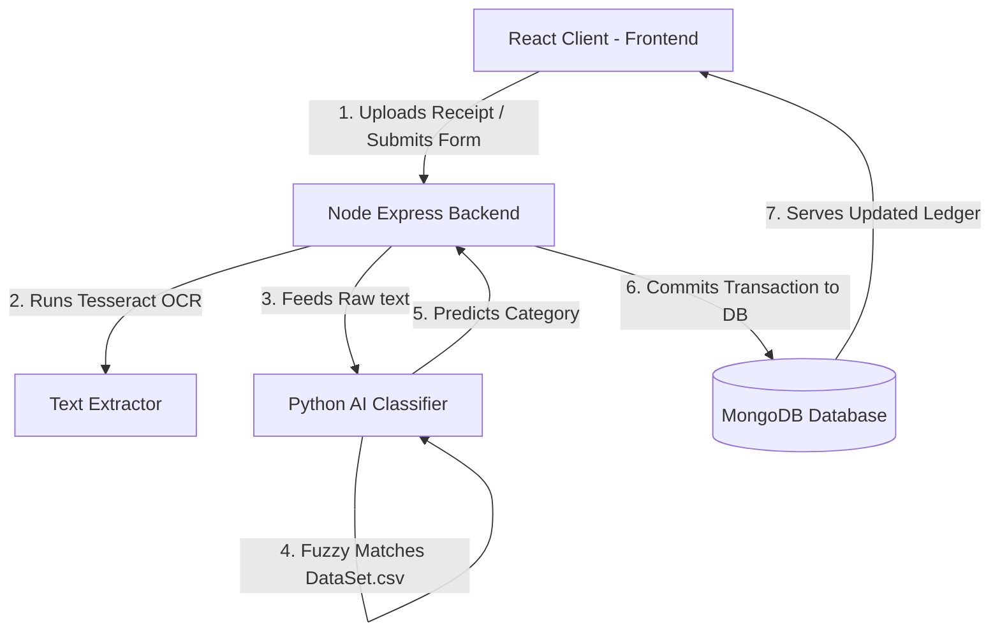

# SpendSmart 💸

SpendSmart is a personal expense tracking and budget management application designed to help users understand, monitor, and optimize their daily spending habits. By integrating **Optical Character Recognition (OCR)** and **AI-powered text classification**, SpendSmart automates receipt entries, segregates purchases into categories, and manages bill splitting within a social network in real time.

---

## Key Features

- 📄 **Smart OCR Receipt Scanner**: Upload receipt photos directly. The app runs text recognition (via Tesseract OCR) to extract line items, merchant details, and total amounts.
- 🤖 **AI-Driven Categorization**: Extracted line items are classified into categories (e.g., Food, Groceries, Rent, Utilities, Garments) using a Python classifier.
- 👥 **Social Split tab Network**: Add friends to your local network and split custom tab shares, sending notifications for payments.
- 📊 **Visual Analytics Dashboard**: View budget splits, balance history, and category expenditures using interactive Recharts diagrams.
- 💳 **Balance Tracking**: Manage separated cash and bank balances dynamically.

---

## System Architecture & Data Flow



1. **OCR Flow**: The user uploads an image of a bill $\rightarrow$ the server runs OCR to extract total values and text contents $\rightarrow$ the AI predicts categories $\rightarrow$ the user confirms split contributors and saves the receipt.
2. **AI Classification Flow**: Preprocesses raw receipt strings by scrubbing brand labels and filler descriptors $\rightarrow$ feeds terms into fuzzy matching sets $\rightarrow$ looks up the closest category in the training dataset (`DataSet.csv`).

---

## Directory Structure

```text
spendSmart/
├── AI/                          # Python AI Classification Model
│   ├── app.py                   # API Wrapper hosting model classifier
│   ├── AI.py                    # Fuzzy text mapping logic
│   ├── DataSet.csv              # Categories dataset
│   └── requirement.txt          # Python dependencies
├── Backend/                     # Node.js + Express REST API Server
│   ├── config/                  # DB configuration settings
│   ├── controllers/             # Request handlers (auth, payments, ledger)
│   ├── models/                  # MongoDB Schema definitions
│   ├── routes/                  # API endpoints routes mapping
│   ├── server.js                # Server main entrypoint
│   └── .env                     # Local environment variables
└── Frontend/                    # React + Vite Client
    ├── src/
    │   ├── assets/              # Interface graphics & mocks
    │   ├── components/          # App pages and views
    │   ├── api.js               # Centralized endpoint mapper
    │   ├── index.css            # Global Light Theme variables
    │   └── main.jsx             # React initialization mount
    └── vite.config.js           # Vite server settings
```

---

## Local Development & Setup

Follow these steps to run SpendSmart locally on your machine.

### Prerequisites
- **Node.js** (Latest LTS version recommended)
- **MongoDB** (Local instance or Mongo Atlas URI)
- **Python 3.9+** (For the AI classifier service)

---

### Step 1: Clone the Repository
```bash
git clone https://github.com/Love-M-365/SpendSmart.git
cd SpendSmart
```

---

### Step 2: Configure the Backend Server
1. Navigate to the `Backend` directory:
   ```bash
   cd Backend
   ```
2. Install the Node packages:
   ```bash
   npm install
   ```
3. Create a `.env` file inside the `Backend` folder:
   ```env
   PORT=5000
   MONGO_URI=your_mongodb_connection_string
   JWT_SECRET=your_jwt_signature_secret
   ```
4. Start the development server:
   ```bash
   npm run dev
   ```
   *The server runs by default on `http://localhost:5000`.*

---

### Step 3: Configure the AI Classification Model
1. Open a new terminal session and navigate to the `AI` directory:
   ```bash
   cd AI
   ```
2. Create and activate a Python virtual environment:
   ```bash
   # Windows
   python -m venv myenv
   myenv\Scripts\activate

   # macOS / Linux
   python3 -m venv myenv
   source myenv/bin/activate
   ```
3. Install the dependencies:
   ```bash
   pip install -r requirement.txt
   ```
4. Start the classification endpoint:
   ```bash
   python app.py
   ```
   *The model wrapper runs by default on `http://localhost:8000`.*

---

### Step 4: Configure the Frontend client
1. Open a third terminal session and navigate to the `Frontend` directory:
   ```bash
   cd Frontend
   ```
2. Install the dependencies:
   ```bash
   npm install
   ```
3. Verify or adjust the API mappings in `src/api.js` to point to your local backend server if desired.
4. Run the React client:
   ```bash
   npm run dev
   ```
   *The browser will launch the app at `http://localhost:5173`.*

---

## Future Roadmap

- 📊 **Export & Backup Ledger**: Download transaction reports in PDF, Excel, or CSV formats for personal bookkeeping.
- 🏆 **Gamification & Goals**: Earn badges, split-rewards, and track streak metrics for staying under monthly budget targets.
- 📱 **Native Mobile Client**: Launch SpendSmart as a mobile app (built with React Native or Flutter) for easier receipt capturing.
- 🎙️ **Voice Assistant Integrations**: Input transactions naturally using voice inputs ("Add Indian food tab of ₹250 to Food").

---

## License

This project is licensed under the MIT License - see the LICENSE file for details.
